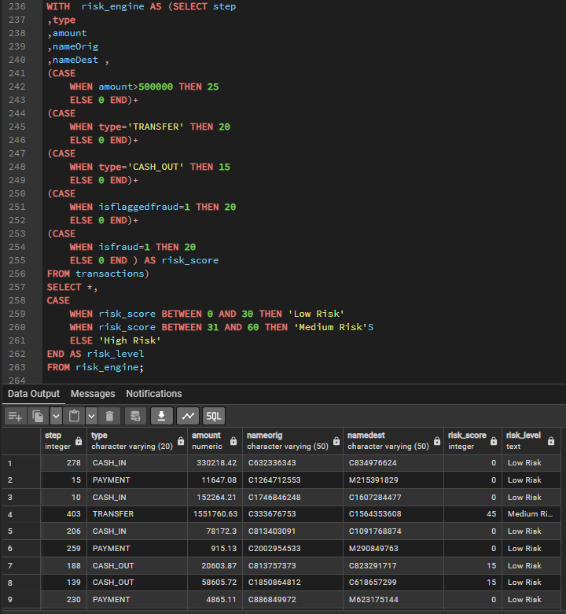
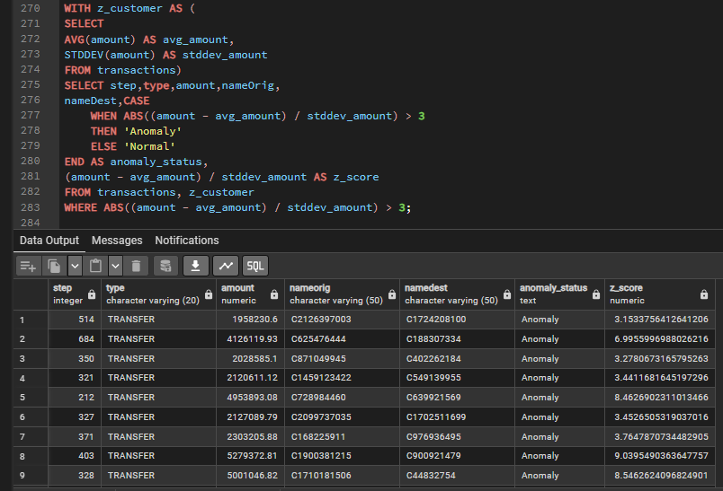
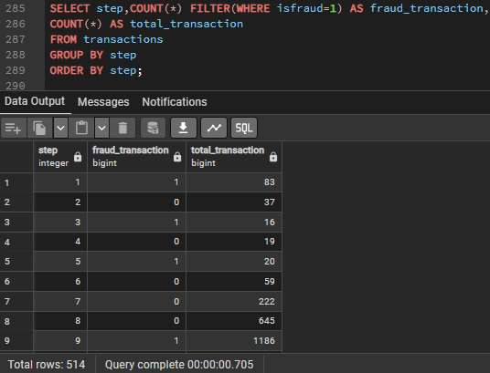
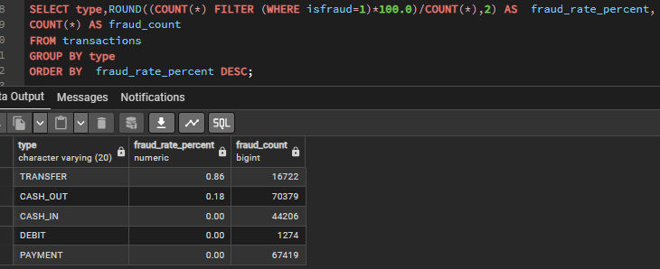
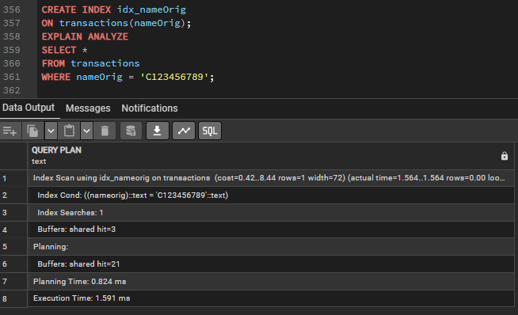

<<<<<<< HEAD
# Fraud Detection Analytics using SQL

## An end-to-end SQL project that analyzes financial transactions, detects suspicious activities, and applies advanced SQL techniques to solve real world fraud analysis problems

# Project Overview
* Financial fraud is a major challenge for banks and digital payment platforms, making it important to identify suspicious transactions as early as possible. In this project, I analyzed a financial transaction dataset using PostgreSQL to explore transaction patterns, detect fraudulent activities, and build a rule-based risk scoring system

* The project covers the complete analysis process, including data exploration, fraud pattern analysis, Risk Scoring & Classification, anomaly detection using Z-Score, and SQL query optimization. Along the way, I applied advanced SQL concepts such as CTEs, Window Functions, Views, Materialized Views, Indexes, and EXPLAIN ANALYZE to solve practical business problems and improve query performance

# Project Statement

Financial institutions process millions of transactions every day, making it difficult to identify fraudulent activities manually. Detecting suspicious transactions quickly is essential to reduce financial losses and improve security. The objective of this project is to analyze financial transaction data using SQL, identify fraud patterns, calculate transaction risk scores, detect anomalies, and generate business insights that can support fraud investigation

# Dataset Information

* The project uses the PaySim Financial Transactions Dataset, a synthetic dataset that simulates real world mobile money transactions It contains different transaction types such as CASH_IN, CASH_OUT, DEBIT, PAYMENT, and TRANSFER, along with fraud labels used to identify fraudulent activities

* The dataset includes transaction details such as transaction amount, sender and receiver accounts, transaction type, time step, and fraud indicators It provides a realistic environment for performing fraud analysis, risk scoring, anomaly detection, and SQL optimization

# Dataset Preparation

The original PaySim dataset contains more than **6 million transaction records** To make the project easier to manage while preserving realistic transaction patterns, a representative sample of approximately **200,000 rows** was extracted and imported into PostgreSQL This allowed faster query execution and easier experimentation without significantly affecting the analysis.

#  Objectives

- Analyze financial transaction data to understand transaction patterns and fraud behavior
- Identify suspicious transactions using SQL-based fraud analysis techniques
- Build a rule-based risk scoring system to classify transaction risk levels
- Detect unusual transactions using statistical anomaly detection (Z-Score)
- Apply advanced SQL concepts such as CTEs, Window Functions, Views, Materialized Views, Indexes, and Query Optimization
- Generate business insights that can support fraud investigation and decision-making

# Tech Stack

| Category | Technology |
|----------|------------|
| **Database** | PostgreSQL 18 |
| **Query Tool** | pgAdmin 4 |
| **Language** | SQL |
| **Dataset** | PaySim Financial Transactions Dataset |
| **Version Control** | Git & GitHub |

# Project Workflow

```text
Financial Transaction Dataset
            │
            ▼
      Data Cleaning
            │
            ▼
 Exploratory Data Analysis
            │
            ▼
 Fraud Pattern Analysis
            │
            ▼
  Risk Scoring & Classification
            │
            ▼
 Z-Score Anomaly Detection
            │
            ▼
 Time-Based Analysis
            │
            ▼
 SQL Optimization
(Views, Materialized Views, Indexes, EXPLAIN ANALYZE)
            │
            ▼
     Business Insights
```

#  SQL Concepts Covered

## Basic SQL
- SELECT
- WHERE
- ORDER BY
- GROUP BY
- HAVING
- Aggregate Functions (SUM, COUNT, AVG, MAX, MIN)

## Intermediate SQL
- CASE WHEN
- Common Table Expressions (CTEs)
- Subqueries
- Conditional Aggregation
- Filtering & Sorting

## Advanced SQL
- Window Functions
  - ROW_NUMBER()
  - DENSE_RANK()
  - SUM() OVER()
  - COUNT() OVER()

- Views
- Materialized Views
- Indexes
- EXPLAIN ANALYZE
- Query Optimization

## Fraud Analytics Techniques
- Rule-Based Risk Scoring
- Risk Level Classification
- Z-Score Anomaly Detection
- Time-Based Fraud Analysis

#  Business Questions Solved

This project answers several real-world business questions related to financial fraud detection including:

- What is the overall distribution of fraudulent and non-fraudulent transactions?
- Which transaction types are most frequently associated with fraud?
- Which customers have the highest total transaction amounts?
- How can customers be ranked based on their transaction value?
- How can a rule-based risk score be assigned to each transaction?
- Which transactions fall into Low, Medium, or High Risk categories?
- Which transactions are statistical anomalies based on Z-Score analysis?
- How does fraud activity change over different time steps?
- How can SQL queries be optimized using Views, Materialized Views, Indexes, and EXPLAIN ANALYZE?
- These business questions simulate real-world fraud investigation scenarios where SQL is used to identify suspicious transactions, prioritize high-risk cases and support data-driven decision-making

# Project Highlights

- Built a rule-based **Risk Scoring Engine (0–100)** to classify transaction risk using multiple fraud indicators
- Classified transactions into **Low, Medium, and High Risk** categories based on calculated risk scores
- Applied **Z-Score Anomaly Detection** to identify statistically unusual transactions
- Performed **Time-Based Fraud Analysis** to observe fraud trends across transaction time steps
- Used **CTEs, Subqueries, CASE WHEN, and Window Functions** to solve complex analytical problems
- Created reusable **Views** and **Materialized Views** to simplify reporting and improve query performance
- Optimized query execution using **Indexes** and verified performance with **EXPLAIN ANALYZE**
- Worked with a representative sample of **~200,000 transactions** extracted from the original **6+ million record** PaySim dataset

# Folder Structure
Fraud-Detection-SQL/

 ## 📂 Dataset
   - paysim_transactions.csv

 ## 📂 SQL Scripts
   - Phase_1_Data_Cleaning.sql
   - Phase_2_EDA.sql
   - Phase_3_Advanced_SQL.sql
   - Phase_4_Fraud_Analysis.sql
   -  Phase_5_Time_Analysis.sql
   -  Phase_6_SQL_Optimization.sql

 ## 📂 Screenshots
   - readme/
   - walkthrough/

 ## 📂 docs
   - Project_Walkthrough.md

### README.md
### LICENSE

> **Note:** The project is organized phase-wise to reflect the complete fraud analysis workflow, making it easier to navigate and understand each stage of the implementation.

# Screenshots

## Risk Score and Classification

> **Note:** Rule-based Risk Scoring Engine used to assign transaction risk scores and classify transactions into Low, Medium, and High Risk categories

## Z-Score Anomaly Detection

> **Note:** Transactions with an absolute Z-Score greater than 3 are classified as statistical anomalies

## Time Decay Analysis

> **Note:** Displays fraud and total transaction counts across different transaction time steps, helping identify how fraud activity changes over time

## Fraud Rate by Transaction Type

> **Note:** Shows the percentage distribution of fraudulent transactions across different transaction types, helping identify which transaction categories are more prone to fraud

## Query Optimization with EXPLAIN ANALYZE

> **Note:** Demonstrates query optimization by using an index and validating its performance with EXPLAIN ANALYZE, resulting in an Index Scan for faster data retrieval